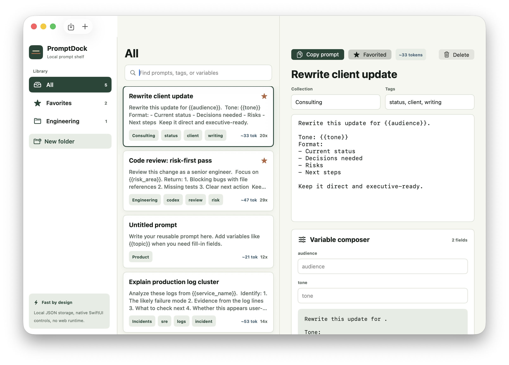
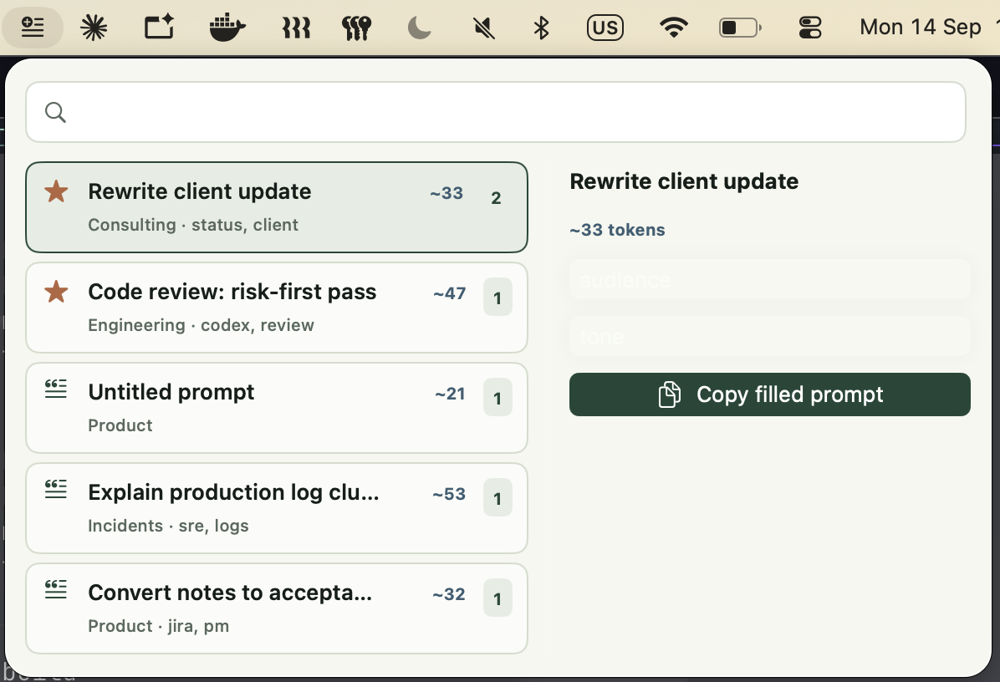

# PromptDock

Fast native macOS app for saving, organizing, and reusing AI prompts.

PromptDock gives you a local prompt library and a menu bar quick picker for Codex, Claude Code, ChatGPT, Cursor, Terminal, Slack, Jira, and consulting workflows.

## Download

Download the latest macOS DMG from:

https://github.com/sukeesh/promptdock/releases/latest

## Screenshots





## Features

- Native macOS app built with SwiftUI
- Menu bar prompt picker
- Local prompt library
- Folders and favorites
- Search by title, body, folder, or tag
- Fillable variables like `{{topic}}`
- Approximate token counts
- Copy confirmation with toast feedback
- Import prompts from text, Markdown, XML, and Sublime snippets
- Local JSON storage
- No Electron
- No cloud account

## Why PromptDock?

AI prompt reuse should be instant. Most people keep prompts in notes, text files, or old chat threads. PromptDock keeps reusable prompts searchable, editable, and one click away from the macOS menu bar.

## Install

1. Download `PromptDock.dmg` from the latest release.
2. Open the DMG.
3. Drag `PromptDock.app` to Applications.
4. Open PromptDock.

If macOS blocks the app because it is not notarized yet, right click the app and choose Open.

## Build From Source

```sh
git clone https://github.com/sukeesh/promptdock.git
cd promptdock
swift run PromptDock
```

Build a release app and DMG:

```sh
./scripts/build-release.sh
./scripts/create-dmg.sh
```

The DMG is created in `dist/`.

## Storage

PromptDock stores prompts locally:

```text
~/Library/Application Support/PromptDock/
```

## Release

Create a GitHub release after authenticating `gh`:

```sh
gh auth login -h github.com
./scripts/release-github.sh
```

## License

MIT
